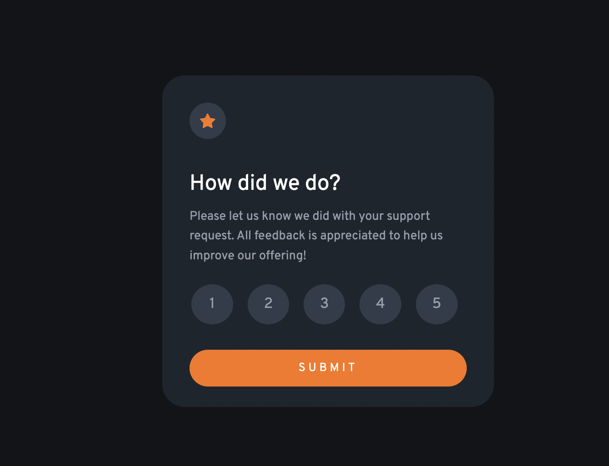

# Frontend Mentor - Interactive rating component solution

This is a solution to the [Interactive rating component challenge on Frontend Mentor](https://www.frontendmentor.io/challenges/interactive-rating-component-koxpeBUmI). Frontend Mentor challenges help you improve your coding skills by building realistic projects. 

## Table of contents

- [Overview](#overview)
  - [The challenge](#the-challenge)
  - [Screenshot](#screenshot)
  - [Links](#links)
- [My process](#my-process)
  - [Built with](#built-with)
- [Author](#author)

## Overview

### The challenge

Users should be able to:

- View the optimal layout for the app depending on their device's screen size
- See hover states for all interactive elements on the page
- Select and submit a number rating
- See the "Thank you" card state after submitting a rating

### Screenshot

### Site Link

- Live Site URL: [Add live site URL here](https://your-live-site-url.com)

## My process

I chose to use a div for the card itself, and then use separate child divs to house each card layout. I used a simple event listener to ensure that a radio button was chosen and change the card upon the user clicking the submit button.

### Built with

- Semantic HTML5 markup
- CSS custom properties
- Flexbox
- JavaScript
- jQuery - JS library

## My links

- LinkedIn - Alec Hapiak https://www.linkedin.com/alec-hapiak
